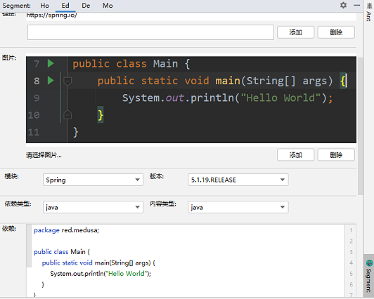
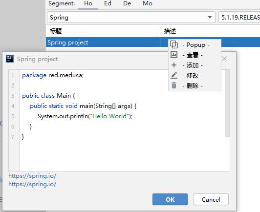
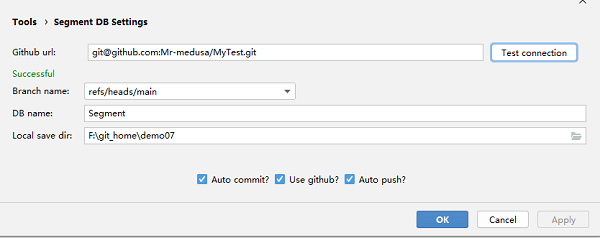

### MySegment

#### 一个基于 IntelliJ IDEA 插件平台 + Github 开发的 "云"· 笔记插件

### 环境

本地安装 **git**,**Android Studio** 版本最低为 **4.1.1**

### 使用

下载源码进入根目录 ,**打开命令行窗口执行 gradlew clean assemble**,在 **build\distributions** 获得**zip** 文件,在 **IDEA** 中打开 **File|Settings|Plugins**  选择从本地安装,导入刚才获得的 **zip** 文件

- **本地使用:** 在 **File|settings|Segment DB Settings** 中配置 **Local save dir**
- **远程仓库:** 依赖上一步,在 **File|Settings|Tools|Segment DB Settings** 中配置勾选 **Use Github**,配置 **Github url**仓库地址
- **自动提交:** 在 **File|Settings|Tools|Segment DB Settings** 勾选 **autoCommit**
- **自动推送:** 在 **File|Settings|Tools|Segment DB Settings** 勾选 **autoPush**

注意: 仅拉取时可以使用 **https**,但是 **自动 push** 只能使用 **ssh**,因此需要配置公钥放到远程仓库

- **Ctrl + 左键：** **Popup** 
- **Ctrl + B:** **切换分支**
- **Ctrl + Q:** **断开数据库连接**
- **Ctrl + W:** **开启数据库连接**